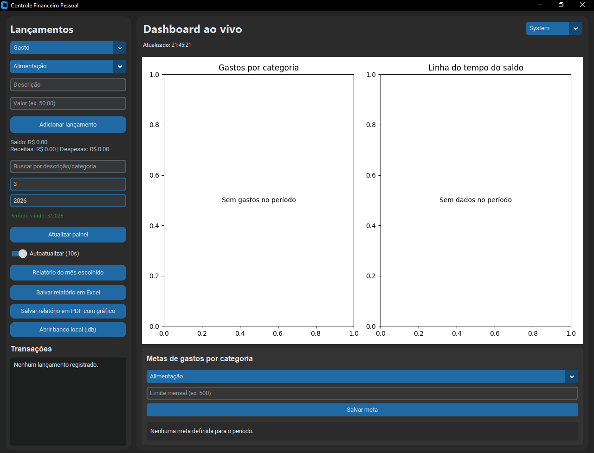
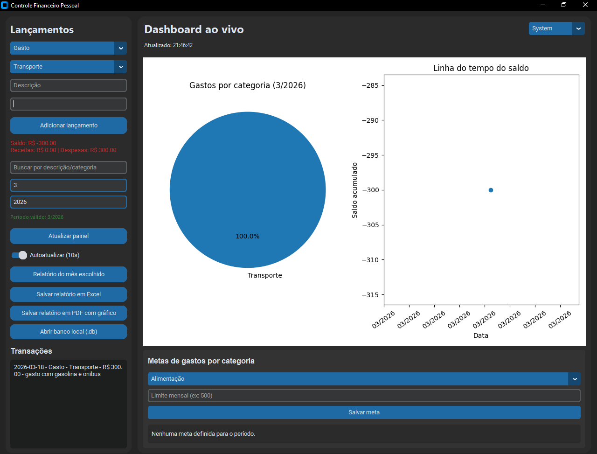

Controle Financeiro Pessoal (Python + CustomTkinter)
Relatório simples feito para despesas curtas

[]()
[]()
[]()
[]()
[]()

Aplicativo simples e objetivo para controle financeiro pessoal em Windows, feito em Python com interface moderna via CustomTkinter. Permite registrar receitas e gastos, visualizar saldo, acompanhar dashboard ao vivo (pizza + linha do tempo), definir metas por categoria e exportar relatórios mensais em Excel e PDF.

**Público-alvo:** usuários que desejam um controle básico, direto e local dos lançamentos financeiros, com armazenamento local em SQLite (sem instalação extra).

Projeto com expansões de funcionalidades
[](https://postimg.cc/TLFFbQBT)

## Prints do Projeto




## Funcionalidades do projeto

- Adicionar lançamentos de **Receita** e **Gasto**
- **Categorias** pré-definidas (Alimentação, Transporte, Lazer, Contas, Remédios, Outros)

- **Cálculo automático** de saldo, total de receitas e total de despesas

- **Dashboard ao vivo** com gráfico de pizza por categoria e linha do tempo de saldo mensal

- **Metas por categoria** com barra de progresso e alertas ao aproximar/ultrapassar o limite

- **Tema dinâmico** (System, Dark, Light) e indicador de última atualização do painel

- **Atalhos de teclado**: `Ctrl+Enter` para adicionar lançamento e `Ctrl+F` para busca

- **Busca de transações** por descrição ou categoria

- **Relatórios mensais** (visualização, Excel e PDF com gráfico embutido)

- **Abertura rápida** do banco local `gastos.db` no app padrão do sistema.

## Requisitos

- Python 3.10 ou superior
- Pacotes: `customtkinter`, `pandas`, `matplotlib`, `fpdf`, `openpyxl`

> O SQLite é nativo do Python (módulo `sqlite3`), então não precisa instalar nada extra para o banco.

> Observação: o `openpyxl` é necessário para salvar relatórios em Excel (`.xlsx`).

## Instalação

Clone o repositório e instale as dependências:

```bash
git clone https://github.com/NatanLuz/planilhagastoteste.git
cd planilhagastoteste

# (Opcional) criar ambiente virtual
python -m venv .venv
.venv\Scripts\activate

# Instalar pacotes necessários
pip install -r requirements.txt
```

## Execução

Inicie a aplicação:

```bash
python app.py
```

Atalhos na interface:

- `Ctrl+Enter`: adiciona lançamento rapidamente
- `Ctrl+F`: foca no campo de busca de transações

Ao iniciar, o sistema cria automaticamente o banco `gastos.db` (se ele não existir).

Se existir um `Gastos.csv` antigo, o app migra os dados automaticamente para o SQLite na primeira execução.

## Estrutura dos Dados (SQLite)

Arquivo: `gastos.db`

Tabela `lancamentos`:

- `Data` (YYYY-MM-DD)
- `Tipo` (`Receita` ou `Gasto`)
- `Categoria` (uma das categorias pré-definidas)
- `Descrição` (texto livre)
- `Valor` (número positivo)

Tabela `metas`:

- `categoria`
- `ano`
- `mes`
- `limite`

## Relatórios

- **Visualização do relatório mensal:** informar mês e ano na interface e clicar em "Relatório do mês escolhido".
- **Salvar em Excel:** gera `Relatorio_<ANO>_<MES>.xlsx` usando `openpyxl`.
- **Salvar em PDF:** gera `Relatorio_<ANO>_<MES>.pdf` usando `FPDF`, com gráfico de gastos embutido.

Arquivos de exemplo presentes no repositório:

- `Relatorio_2025_7.xlsx`
- `Relatorio_2025_7.pdf`
  (Quando salva o arquivo, pode mudar o formato, utilize o .PDF,.docx..)

## Estrutura do Projeto

- `app.py`: aplicação principal com a interface gráfica
- `Core/dados.py`: camada de dados (SQLite + migração do CSV + metas)
- `Core/relatorios.py`: funções de relatório (apoio)
- `gastos.db`: base de dados local (SQLite)

## Testes Automatizados

Instale dependências de desenvolvimento:

```bash
pip install -r requirements-dev.txt
```

Execute os testes:

```bash
pytest
```

Os testes cobrem os fluxos principais de `Core/dados.py`:

- Inicialização do banco
- Inclusão e cálculo de saldo
- Relatório mensal, resumo por categoria e série de saldo
- Metas por categoria e progresso
- Migração CSV -> SQLite

## Empacotar em .exe (Windows)

Use o script de build:

```powershell
.\build_exe.ps1
```

Ao final, o executável estará em:

- `dist/ControleFinanceiro/ControleFinanceiro.exe`

Também serão gerados artefatos versionados:

- `dist/ControleFinanceiro-<versao>.exe`
- `dist/ControleFinanceiro-<versao>-win64.zip`

## Release com versionamento automático

O script `release.ps1` resolve a versão automaticamente via tags Git semver.

Regras:

- Se informar `-Version`, usa essa versão (ex: `v1.2.3`).
- Se não informar versão, calcula a próxima patch com base na última tag (ex: `v1.2.3` -> `v1.2.4`).

### Exemplos de uso

Gerar release local (sem criar tag):

```powershell
.\release.ps1 -PythonCommand ".\.venv\Scripts\python.exe"
```

Gerar release com versão explícita:

```powershell
.\release.ps1 -PythonCommand ".\.venv\Scripts\python.exe" -Version v1.3.0
```

Criar tag e gerar release:

```powershell
.\release.ps1 -PythonCommand ".\.venv\Scripts\python.exe" -Version v1.3.0 -CreateTag
```

Criar tag, enviar para origin e gerar release:

```powershell
.\release.ps1 -PythonCommand ".\.venv\Scripts\python.exe" -Version v1.3.0 -CreateTag -PushTag
```

Ao final do fluxo, uma pasta de release é criada em:

- `releases/vX.Y.Z/`

Conteúdo padrão da release:

- executável versionado
- zip versionado
- `SHA256SUMS.txt`
- `RELEASE_NOTES.md`

## Autor

Natan Luz

Contato: natandaluz01@gmail.com
